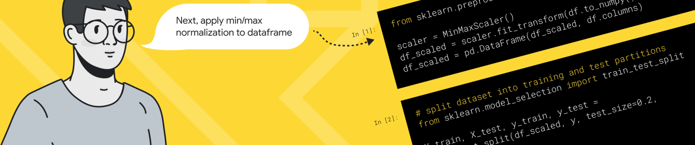
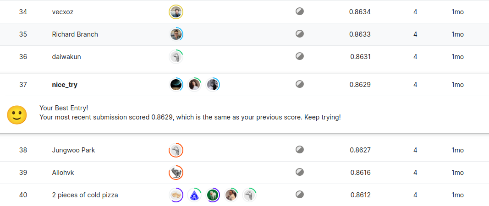
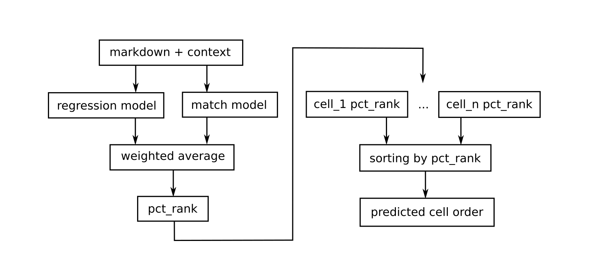
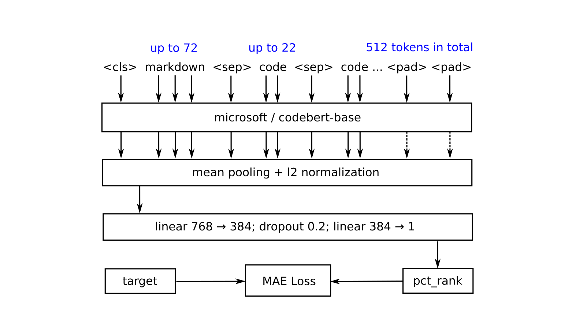
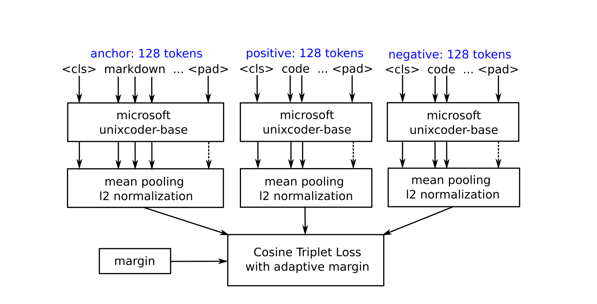
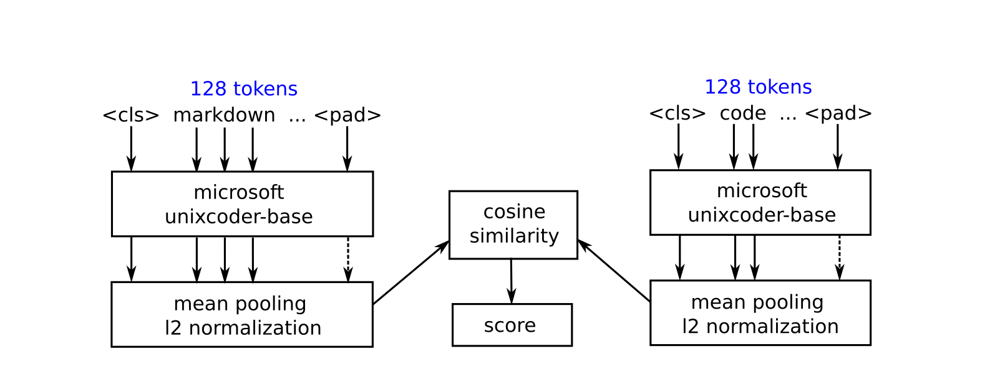

### Solution to the Google AI4Code Competition

#### Description
The goal of this [competition](https://www.kaggle.com/competitions/AI4Code) was to understand the relationship between code and comments in Python notebooks. We were challenged to reconstruct the order of markdown cells in a given notebook based on the order of the code cells, demonstrating comprehension of which natural language references which code. Predictions were evaluated by the [Kendall tau correlation](https://en.wikipedia.org/wiki/Kendall_rank_correlation_coefficient) between predicted cell orders and ground truth cell orders accumulated across the entire collection of test set notebooks.

#### Results: 37 / 1200, top 4% 🥳
Our team:
[Valentin Aliferov](https://github.com/vaaliferov), 
[Polina Roshchina](https://github.com/palinkapro), 
[Milana Shhanukova](https://github.com/MilanaShhanukova)

#### Solution
The solution is basically an ensemble of 2 different models (regression-based and matching-based) which both predict the relative positions of markdown cells in a given notebook. The predictions are combined together using simple weighted average technique and then used to get the expected cell order. This solution is relatively light and fast. It takes ~1.5 hours to prepare the data, ~15 hours to train both models (on TPUs kindly provided by Kaggle), and also ~3.5 hours to make a submission (on GPU). We also managed to fit all the data in memory and switched to using tfrecords only for the matching model (starting from negative sampling of 5+ examples per markdown). This is our first experience with Tensorflow and Keras.

#### Regression Model
This model maps a sequence of 512 tokens (an encoded markdown cell with its context) to a real value (the relative position of that markdown cell in the notebook) using microsoft/codebert-base backbone and mean absolute error loss. In this particular case we have one single training example for each markdown cell. To generate such an example we firstly encode a markdown cell content and then truncate it to up to 72 tokens. We then find a sequence of evenly spaced code cells (of a given notebook) which fits the remaining space the best (each code cell is truncated to up to 22 tokens). In case we still have some remaining space, we fill it up with special pad tokens. It enables us to use the available input sequence length quite efficiently. In the formula below $y_i$ and $\hat{y_i}$ are true and predicted relative positions of a given markdown cell.

$$MAELoss = |y_i - \hat{y_i}|$$

&nbsp;

#### Matching Model
This model is based on the idea of finding the best match for each individual markdown cell among all the code cells of a given notebook, and then rearranging the cell order of this notebook, so that the matching cells are close to each other. We acheive this by setting markdown cell relative positions to the same values as the matching code cells have, and then substructing a small offset to make sure that all the markdowns come first. This way we are able to obtain the same kind of predictions as the regression model produces, and then easily combine the results using simple weighted average techinque. This is a triplet net embedder model based on microsoft/unixcoder-base backbone and triplet loss with adaptive margin. We use cosine similarity of the output embeddings as a measure of distance. In this case we have a triplet of an anchor markdown, positive code, and a negative code as a single training example. The model input is truncated to up to 128 tokens with the following padding at the end if necessary. We also calculate an adaptive margin for each training example (triplet) in order to take into account how actually far the cells are from each other in terms of their relative positions in a given notebook. We extract up to 7 triplets for each markdown cell (the same markdown and positive code cells, but different negatives). In the formulas below $A$, $P$, and $N$ are anchor, positive, and negative embeddings accordingly, and also $R_A$, $R_P$, and $R_N$ are anchor, positive, and negative relative positions.

$$cosine\textunderscore similarity = \frac{A*B}{\|A\|*\|B\|}$$

$$margin = |R_A - R_P| - |R_A - R_N|$$

$$TripletLoss = cos(A,N) - cos(A,P) + margin$$ 

&nbsp;

During inference time we extract embeddings for all the cells firstly, and then find the best matches (with the highest cosine similarity) for each markdown among all the code cells (notebook-wise). We then set the relative positions of markdown cells accordingly and combine the results with the regression model predictions. At this point we are ready to sort all the cells and get the desired output.

#### Further improvements
Now, that the first stage of this competition is over and other participants are starting to share their solutions, we are looking forward to learn from them. There are lots of cool ideas out there, it is truly an endless source of knowledge. Thank you, guys!
